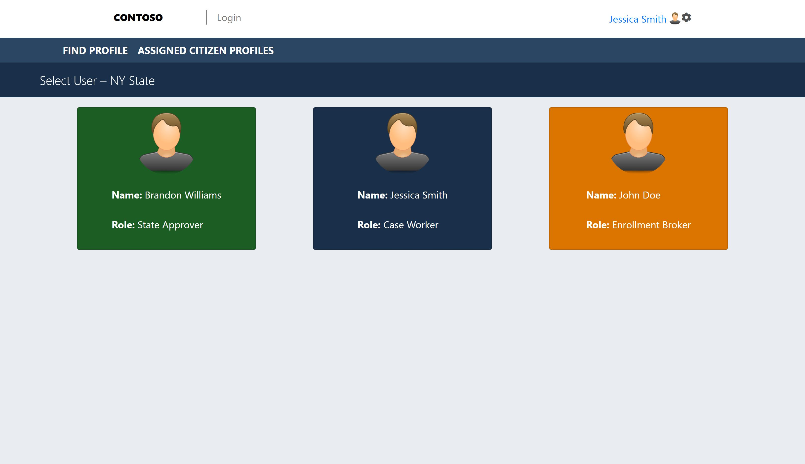
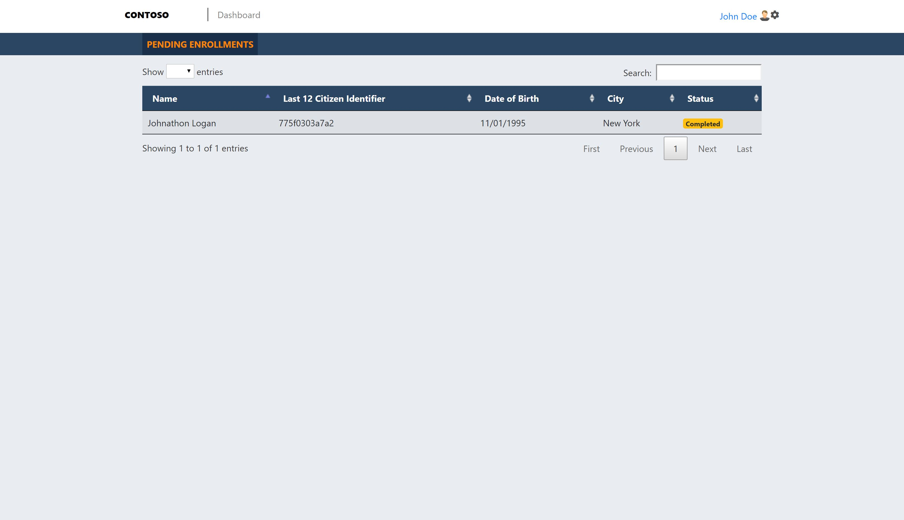

# Application Deployment
After following all previous steps, you will have a resource group containing CosmosDB, a Storage Account, and a Kubernetes cluster. The Kubernetes cluster will be hosting a Hyperledger Fabric blockchain network, and the Healthcare chaincode will be installed while the fabric-server image is serving requests locally to your Fabric network.

There are a few modifications to the [Healthcare Solution](./src/Healthcare.sln) that need to be made to work with your infrastructure. The connection strings need to be updated for the Proof Document Storage service and the Tracker/Indexer services.

To update the necessary appsettings.json connection strings, run the deploy.ps1 script.

## Prerequisites
1. [Service Fabric](https://docs.microsoft.com/en-us/azure/service-fabric/service-fabric-get-started)
2. [Visual Studio](https://visualstudio.microsoft.com/)
3. Updated connection strings

## Options
You can either run the application locally or hosted using Service Fabric in your resource group. To run in Azure follow the guid to [deploying a service fabric .net application](https://docs.microsoft.com/en-us/azure/service-fabric/service-fabric-tutorial-deploy-app-to-party-cluster)

# Steps
1. Open [Healthcare.sln](./src/Healthcare.sln) in Visual Studio (as Admin)
2. Build Project
3. Run the Service Fabric Apphosting project
4. Go to http://localhost:8080 to use the application

## Components
This project contains a number of components described below.

| Resource              | Usage                                                                                     |
|-----------------------|-------------------------------------------------------------------------------------------|
| Tracker Service  | Retrieves information from the MongoDB database in your CosmosDB subscription.          |
| Indexer Service  | Stores each blockchain transaction in the MongoDB store|                                                     |
| Fabric Client               | Sends gRPC requests to the Koltin Server which serves requests to your blockchain network and chaincode                                                    |
| Proof Document Service               | Stores images and adds reference hash to the chaincode                                                    |
| API Service               | Consolidates all requests to a single interface for the UI                                                    |
| WebApp               | The Angular application                                                    |

 # Using the Application

 ## Create a Profile

To create a profile, click on the Case Worker persona, and then click on the create profile link. Pictured below. Be sure to fill all information to a NY address, and add a picture for license validation.

#### Main Page
 

#### Patient Search
 

#### Create Profile Page
 
 
## Assign a Plan

To assign a plan, select the Enrollment broker, select a profile, and then select a plan from the drop down.

## Approve a Plan

To approve a plan, select the State Approver from the main page, select a profile, and then click approve.

